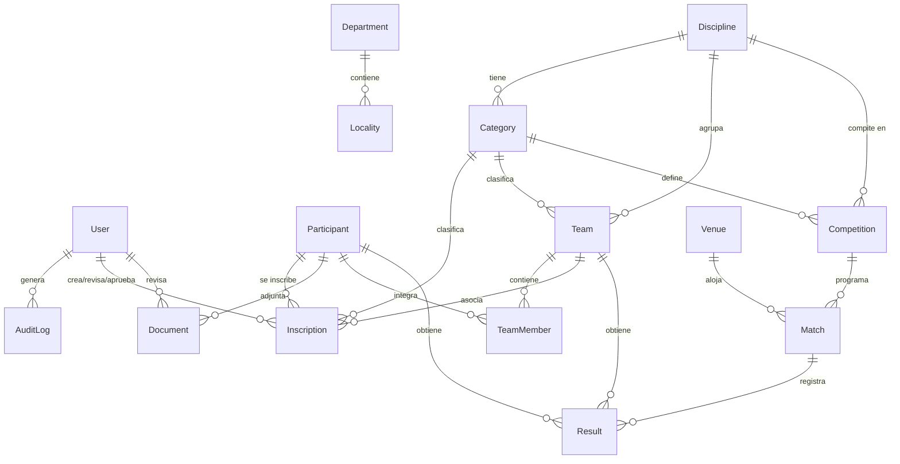

# 📘 Documentación Técnica — Juegos Evita Formosa

---

## 1. Contexto del Proyecto

**Plataforma Integral de Gestión — Juegos Evita Formosa** es un sistema web diseñado para la **Secretaría de Deportes de la Provincia de Formosa**, con el objetivo de digitalizar y centralizar la gestión de los Juegos Evita a nivel provincial.

### ¿Qué resuelve?

La plataforma abarca el ciclo completo de los juegos deportivos:

- **Inscripción de participantes** con generación de código QR único por inscripción.
- **Gestión de disciplinas y categorías** (más de 40 disciplinas, segmentadas por edad y sexo).
- **Armado de equipos** con control de integrantes (mínimos/máximos por disciplina).
- **Gestión documental** (DNI, certificados médicos, autorizaciones) con almacenamiento en MinIO (S3-compatible).
- **Competencias y fixtures** con generación automática (Round Robin, Eliminación Directa, Fase de Grupos).
- **Carga de resultados y rankings** públicos.
- **Sedes** con datos de geolocalización.
- **Noticias y calendario** público de eventos.
- **Dashboard** administrativo con estadísticas cacheadas en Redis.
- **Reportes exportables** a CSV y Excel (participantes, inscripciones, equipos, resultados).
- **Auditoría** completa de todas las acciones del sistema.
- **Sistema de roles granular** con 9 niveles de acceso (desde Super Admin hasta Operador de Mesa).

### Autores

| Nombre |
|---|
| Ayala, Santiago Tomás |
| Colman, Máximo Javier Alexis |
| Pereyra Roman, Ramiro |
| Zigarán, Lucas Natanael |

---

## 2. Stack Tecnológico

### Backend

| Tecnología | Versión | Uso |
|---|---|---|
| **Node.js** | 18+ | Runtime |
| **NestJS** | 11 | Framework backend (módulos, DI, guards, interceptors) |
| **TypeScript** | 5 | Tipado estático |
| **Prisma** | 7 | ORM y migraciones |
| **PostgreSQL** | 16 | Base de datos relacional |
| **Redis** | 7 | Cache (dashboard stats, tokens) |
| **MinIO** | latest | Object storage S3-compatible (documentos, imágenes) |
| **Passport + JWT** | — | Autenticación con access/refresh tokens |
| **Swagger (OpenAPI)** | 11 | Documentación interactiva de la API |
| **Argon2** | 0.44 | Hashing de contraseñas |
| **Helmet** | 8 | Seguridad HTTP headers |
| **Pino** | — | Logging estructurado (JSON en prod, pretty en dev) |
| **ExcelJS** | 4.4 | Generación de reportes XLSX |
| **QRCode** | 1.5 | Generación de códigos QR para inscripciones |
| **Zod** | 4 | Validación de esquemas |
| **class-validator / class-transformer** | — | Validación y transformación de DTOs |
| **Throttler** | 6 | Rate limiting global y por endpoint |
| **Docker Compose** | — | Infraestructura local (PostgreSQL, Redis, MinIO) |

### Frontend

| Tecnología | Versión | Uso |
|---|---|---|
| **React** | 19 | Librería UI |
| **TypeScript** | 6 | Tipado estático |
| **Vite** | 8 | Bundler y dev server |
| **TailwindCSS** | 4 | Framework de estilos utility-first |
| **React Router** | 8 | Routing SPA (rutas públicas y protegidas) |
| **TanStack React Query** | 5 | Data fetching, cache y sincronización |
| **Axios** | 1.18 | Cliente HTTP con interceptores |
| **Radix UI** | 1.6 | Componentes primitivos accesibles (Dialog, Select, Dropdown, Tabs) |
| **React Hook Form** | 7 | Gestión de formularios |
| **Zod** | 4 | Validación de schemas en formularios |
| **Recharts** | 3 | Gráficos del dashboard |
| **Lucide React** | 1.25 | Iconografía |
| **Sonner** | 2 | Notificaciones toast |
| **next-themes** | 0.4 | Soporte dark/light mode |
| **oxlint** | 1.71 | Linter rápido |

### Infraestructura & CI/CD

| Tecnología | Uso |
|---|---|
| **Docker Compose** | Orquestación de servicios en desarrollo (PostgreSQL, Redis, MinIO) |
| **GitHub Actions** | CI/CD (directorio `.github/`) |
| **ESLint + Prettier** | Linting y formateo (backend) |

---

## 3. Arquitectura y Estructura de Carpetas

El proyecto es un **monorepo** con dos aplicaciones separadas:

```
evita/
├── backend/                    # API REST (NestJS)
├── frontend/                   # SPA (React + Vite)
├── .github/                    # GitHub Actions workflows
├── .gitignore
└── README.md                   # Guía de inicio rápido
```

### 3.1 Backend (`backend/`)

```
backend/
├── prisma/
│   ├── schema.prisma           # Esquema de base de datos (16 modelos, 10 enums)
│   ├── seed.ts                 # Script de datos iniciales
│   └── migrations/             # Migraciones SQL auto-generadas
│
├── src/
│   ├── main.ts                 # Bootstrap: Swagger, CORS, Helmet, prefijo /api/v1
│   ├── app.module.ts           # Módulo raíz: importa todos los módulos y registra guards/filters/interceptors globales
│   │
│   ├── config/
│   │   ├── index.ts            # Configuraciones tipadas: app, database, jwt, redis, minio, throttle
│   │   └── config.validation.ts # Validación de variables de entorno con Zod
│   │
│   ├── database/
│   │   ├── database.module.ts  # Módulo de base de datos (Prisma)
│   │   └── prisma.service.ts   # Servicio Prisma singleton
│   │
│   ├── common/
│   │   ├── constants/          # Enums de Roles, grupos de roles, acciones de auditoría
│   │   ├── decorators/         # @Public(), @Roles(), @CurrentUser()
│   │   ├── dto/                # DTOs compartidos (PaginationQueryDto)
│   │   ├── filters/            # GlobalExceptionFilter (manejo centralizado de errores)
│   │   ├── guards/             # RolesGuard (verificación de roles por decorador)
│   │   └── interceptors/       # TransformInterceptor (formato de respuesta estándar)
│   │
│   └── modules/                # Módulos de dominio (17 módulos)
│       ├── auth/               # Login, refresh, logout, me (JWT + Argon2)
│       ├── users/              # CRUD de usuarios administrativos
│       ├── participants/       # CRUD de participantes (jugadores sin login)
│       ├── inscriptions/       # Inscripciones con flujo PENDIENTE→REVISADA→APROBADA/RECHAZADA
│       ├── disciplines/        # Disciplinas deportivas (40+)
│       ├── categories/         # Categorías por disciplina (edad, sexo)
│       ├── teams/              # Equipos con gestión de miembros
│       ├── documents/          # Upload a MinIO, validación de documentos
│       ├── competitions/       # Competencias y generación de fixtures
│       ├── results/            # Carga de resultados y tabla de posiciones
│       ├── venues/             # Sedes de competencia
│       ├── news/               # Noticias con slug
│       ├── calendar/           # Eventos del calendario
│       ├── dashboard/          # Estadísticas globales (cacheadas en Redis)
│       ├── reports/            # Exportación CSV/XLSX
│       ├── audit/              # Log de auditoría
│       └── health/             # Health check del sistema
│
├── docker/                     # Archivos Docker para producción
├── docker-compose.dev.yml      # Compose local: PostgreSQL 16, Redis 7, MinIO
├── docker-compose.yml          # Compose para producción
├── package.json
├── tsconfig.json
├── nest-cli.json
└── .env.example                # Variables de entorno de ejemplo
```

> Cada módulo de dominio sigue la estructura estándar de NestJS:
> `<nombre>.module.ts`, `<nombre>.controller.ts`, `<nombre>.service.ts`, `dto/`

### 3.2 Frontend (`frontend/`)

```
frontend/
├── public/                     # Assets estáticos (favicon, imágenes)
├── src/
│   ├── main.tsx                # Entry point (React + ReactDOM)
│   ├── App.tsx                 # Componente raíz (QueryClientProvider, RouterProvider, ThemeProvider)
│   ├── router.tsx              # Definición de rutas (públicas, auth, admin protegidas)
│   ├── index.css               # Estilos globales + configuración TailwindCSS
│   │
│   ├── api/
│   │   ├── client.ts           # Instancia Axios con interceptores (token, refresh automático)
│   │   ├── auth.api.ts         # Llamadas al módulo Auth
│   │   ├── users.api.ts        # Llamadas al módulo Users
│   │   ├── participants.api.ts # Llamadas al módulo Participants
│   │   ├── inscriptions.api.ts # Llamadas al módulo Inscriptions
│   │   ├── disciplines.api.ts  # Llamadas al módulo Disciplines
│   │   ├── categories.api.ts   # Llamadas al módulo Categories
│   │   ├── teams.api.ts        # Llamadas al módulo Teams
│   │   ├── documents.api.ts    # Llamadas al módulo Documents
│   │   ├── competitions.api.ts # Llamadas al módulo Competitions
│   │   ├── results.api.ts      # Llamadas al módulo Results
│   │   ├── venues.api.ts       # Llamadas al módulo Venues
│   │   ├── news.api.ts         # Llamadas al módulo News
│   │   ├── calendar.api.ts     # Llamadas al módulo Calendar
│   │   ├── dashboard.api.ts    # Llamadas al módulo Dashboard
│   │   ├── reports.api.ts      # Llamadas al módulo Reports
│   │   └── audit.api.ts        # Llamadas al módulo Audit
│   │
│   ├── hooks/                  # Custom hooks (React Query wrappers)
│   │   ├── useCalendar.ts
│   │   ├── useCategories.ts
│   │   ├── useCompetitions.ts
│   │   ├── useDisciplines.ts
│   │   ├── useDocuments.ts
│   │   ├── useInscriptions.ts
│   │   ├── useNews.ts
│   │   ├── useParticipants.ts
│   │   ├── useResults.ts
│   │   ├── useTeams.ts
│   │   ├── useUsers.ts
│   │   └── useVenues.ts
│   │
│   ├── store/
│   │   └── auth.store.tsx      # Estado global de autenticación (Context API)
│   │
│   ├── schemas/
│   │   └── index.ts            # Schemas Zod para validación de formularios
│   │
│   ├── types/
│   │   └── index.ts            # Interfaces TypeScript de todas las entidades
│   │
│   ├── lib/
│   │   ├── constants.ts        # Rutas (ROUTES), enums UI, constantes generales
│   │   └── utils.ts            # Utilidades (cn, formatters)
│   │
│   ├── components/
│   │   ├── ui/                 # Componentes base (Radix UI wrappers): Button, Card, Dialog, Table, Select, Form, Badge, Tabs, Input, etc.
│   │   ├── layout/             # PublicLayout, AdminLayout, Sidebar, AdminHeader, Footer
│   │   └── shared/             # ProtectedRoute y componentes reutilizables
│   │
│   ├── pages/
│   │   ├── auth/
│   │   │   └── LoginPage.tsx
│   │   ├── public/             # Páginas accesibles sin login
│   │   │   ├── HomePage.tsx
│   │   │   ├── DisciplinesPage.tsx
│   │   │   ├── DisciplineDetailPage.tsx
│   │   │   ├── NewsPage.tsx
│   │   │   ├── NewsDetailPage.tsx
│   │   │   ├── CalendarPage.tsx
│   │   │   ├── VenuesPage.tsx
│   │   │   ├── RankingsPage.tsx
│   │   │   ├── CompetitionPublicPage.tsx
│   │   │   ├── InscriptionPage.tsx
│   │   │   └── InscriptionInfoPage.tsx
│   │   └── admin/              # Páginas protegidas (requieren autenticación)
│   │       ├── DashboardPage.tsx
│   │       ├── ParticipantsPage.tsx
│   │       ├── ParticipantDetailPage.tsx
│   │       ├── InscriptionsPage.tsx
│   │       ├── InscriptionDetailPage.tsx
│   │       ├── DelegateInscriptionPage.tsx
│   │       ├── DisciplinesAdminPage.tsx
│   │       ├── CategoriesAdminPage.tsx
│   │       ├── TeamsAdminPage.tsx
│   │       ├── TeamDetailPage.tsx
│   │       ├── CompetitionsPage.tsx
│   │       ├── CompetitionDetailPage.tsx
│   │       ├── ResultsPage.tsx
│   │       ├── DocumentsPage.tsx
│   │       ├── NewsAdminPage.tsx
│   │       ├── CalendarAdminPage.tsx
│   │       ├── VenuesAdminPage.tsx
│   │       ├── UsersPage.tsx
│   │       ├── ReportsPage.tsx
│   │       └── AuditPage.tsx
│   │
│   └── assets/                 # Recursos estáticos importados
│
├── components.json             # Configuración de shadcn/ui
├── vite.config.ts
├── tsconfig.json
├── package.json
├── index.html                  # HTML entry point
└── .env.example
```

---

## 4. Endpoints de la API

**Base URL:** `http://localhost:3000/api/v1`
**Documentación Swagger:** `http://localhost:3000/api/docs`

Todos los endpoints requieren autenticación JWT por defecto (vía header `Authorization: Bearer <token>`), salvo los marcados como **Público**.

---

### 4.1 Health

| Método | Ruta | Descripción | Acceso |
|---|---|---|---|
| `GET` | `/health` | Health check del sistema (estado de BD) | Público |

---

### 4.2 Auth

| Método | Ruta | Descripción | Acceso |
|---|---|---|---|
| `POST` | `/auth/login` | Iniciar sesión (email + contraseña) → access + refresh token | Público (rate limit: 5/15min) |
| `POST` | `/auth/refresh` | Renovar access token usando refresh token | Público (requiere refresh token) |
| `POST` | `/auth/logout` | Cerrar sesión (invalida refresh token) | Autenticado |
| `POST` | `/auth/me` | Obtener datos del usuario autenticado | Autenticado |

---

### 4.3 Users

| Método | Ruta | Descripción | Acceso |
|---|---|---|---|
| `POST` | `/users` | Crear usuario administrativo | SUPER_ADMIN |
| `GET` | `/users` | Listar usuarios (paginado + filtros) | SUPER_ADMIN, ADMIN_PROVINCIAL |
| `GET` | `/users/:id` | Obtener usuario por ID | SUPER_ADMIN, ADMIN_PROVINCIAL |
| `PATCH` | `/users/:id` | Actualizar usuario | SUPER_ADMIN |
| `DELETE` | `/users/:id` | Desactivar usuario (soft delete) | SUPER_ADMIN |

---

### 4.4 Participants

| Método | Ruta | Descripción | Acceso |
|---|---|---|---|
| `POST` | `/participants` | Crear participante | SUPER_ADMIN, ADMIN_PROVINCIAL, ADMIN_DEPARTAMENTAL, ADMIN_ZONAL, DELEGADO |
| `GET` | `/participants` | Listar participantes (paginado + filtros) | Admins, DELEGADO, COORDINADOR |
| `GET` | `/participants/dni/:dni` | Buscar participante por DNI | Admins, DELEGADO, COORDINADOR |
| `GET` | `/participants/:id` | Obtener participante (incluye inscripciones, docs, equipos) | Admins, DELEGADO, COORDINADOR |
| `PATCH` | `/participants/:id` | Actualizar participante | SUPER_ADMIN, ADMIN_PROVINCIAL, ADMIN_DEPARTAMENTAL, DELEGADO |

---

### 4.5 Inscriptions

| Método | Ruta | Descripción | Acceso |
|---|---|---|---|
| `POST` | `/inscriptions` | Inscribir participante (genera QR) | INSCRIPTION_CREATORS |
| `GET` | `/inscriptions/qr/:qrCode` | Consultar inscripción por código QR | Público |
| `GET` | `/inscriptions` | Listar inscripciones (paginado + filtros) | INSCRIPTION_REVIEWERS |
| `GET` | `/inscriptions/:id` | Obtener inscripción (participante, docs, equipo) | INSCRIPTION_REVIEWERS |
| `PATCH` | `/inscriptions/:id/review` | Revisar inscripción (PENDIENTE → REVISADA) | INSCRIPTION_REVIEWERS |
| `PATCH` | `/inscriptions/:id/approve` | Aprobar inscripción (REVISADA → APROBADA) | INSCRIPTION_APPROVERS |
| `PATCH` | `/inscriptions/:id/reject` | Rechazar inscripción (con motivo obligatorio) | INSCRIPTION_REVIEWERS |

**Flujo de estados:** `PENDIENTE` → `REVISADA` → `APROBADA` / `RECHAZADA`

---

### 4.6 Disciplines

| Método | Ruta | Descripción | Acceso |
|---|---|---|---|
| `POST` | `/disciplines` | Crear disciplina | SUPER_ADMIN, ADMIN_PROVINCIAL |
| `GET` | `/disciplines` | Listar disciplinas (paginado + filtros) | Público |
| `GET` | `/disciplines/:id` | Obtener disciplina (incluye categorías) | Público |
| `PATCH` | `/disciplines/:id` | Actualizar disciplina | SUPER_ADMIN, ADMIN_PROVINCIAL |
| `DELETE` | `/disciplines/:id` | Eliminar disciplina | SUPER_ADMIN, ADMIN_PROVINCIAL |

---

### 4.7 Categories

| Método | Ruta | Descripción | Acceso |
|---|---|---|---|
| `POST` | `/categories` | Crear categoría | SUPER_ADMIN, ADMIN_PROVINCIAL |
| `GET` | `/categories` | Listar categorías (filtrable por disciplina, sexo) | Público |
| `GET` | `/categories/:id` | Obtener categoría | Público |
| `PATCH` | `/categories/:id` | Actualizar categoría | SUPER_ADMIN, ADMIN_PROVINCIAL |
| `DELETE` | `/categories/:id` | Eliminar categoría | SUPER_ADMIN, ADMIN_PROVINCIAL |

---

### 4.8 Teams

| Método | Ruta | Descripción | Acceso |
|---|---|---|---|
| `POST` | `/teams` | Crear equipo | Admins, DELEGADO, COORDINADOR |
| `GET` | `/teams` | Listar equipos (paginado) | Admins, DELEGADO, COORDINADOR |
| `GET` | `/teams/:id` | Obtener equipo (incluye miembros) | Admins, DELEGADO, COORDINADOR |
| `PATCH` | `/teams/:id` | Actualizar equipo | Admins, DELEGADO |
| `DELETE` | `/teams/:id` | Eliminar equipo | Admins, DELEGADO |
| `POST` | `/teams/:id/members` | Agregar participante al equipo | Admins, DELEGADO, COORDINADOR |
| `DELETE` | `/teams/:id/members/:participantId` | Remover participante del equipo | Admins, DELEGADO, COORDINADOR |

---

### 4.9 Documents

| Método | Ruta | Descripción | Acceso |
|---|---|---|---|
| `POST` | `/documents/upload` | Subir documento (multipart, max 5MB, jpeg/png/pdf) | Admins, DELEGADO |
| `GET` | `/documents/participant/:participantId` | Listar documentos del participante (URLs presignadas) | Admins, DELEGADO, COORDINADOR |
| `PATCH` | `/documents/:id/review` | Validar o rechazar documento | Admins |

---

### 4.10 Competitions

| Método | Ruta | Descripción | Acceso |
|---|---|---|---|
| `POST` | `/competitions` | Crear competencia | Admins |
| `GET` | `/competitions` | Listar competencias (paginado) | Público |
| `GET` | `/competitions/:id` | Obtener competencia y su fixture (partidos) | Público |
| `PATCH` | `/competitions/:id` | Actualizar competencia | Admins |
| `POST` | `/competitions/:id/fixture` | Generar fixture automáticamente (Round Robin, etc.) | Admins |

---

### 4.11 Results

| Método | Ruta | Descripción | Acceso |
|---|---|---|---|
| `PATCH` | `/results/match/:matchId` | Cargar/actualizar resultados de un partido | Admins, ARBITRO |
| `GET` | `/results/rankings/competition/:competitionId` | Obtener tabla de posiciones de una competencia | Público |

---

### 4.12 Venues

| Método | Ruta | Descripción | Acceso |
|---|---|---|---|
| `POST` | `/venues` | Crear sede | Admins |
| `GET` | `/venues` | Listar sedes (paginado) | Público |
| `GET` | `/venues/:id` | Obtener sede por ID | Público |
| `PATCH` | `/venues/:id` | Actualizar sede | Admins |
| `DELETE` | `/venues/:id` | Eliminar sede | Admins |

---

### 4.13 News

| Método | Ruta | Descripción | Acceso |
|---|---|---|---|
| `POST` | `/news` | Crear noticia | Admins |
| `GET` | `/news` | Listar noticias (paginado) | Público |
| `GET` | `/news/slug/:slug` | Obtener noticia por slug | Público |
| `GET` | `/news/:id` | Obtener noticia por ID | Público |
| `PATCH` | `/news/:id` | Actualizar noticia | Admins |
| `DELETE` | `/news/:id` | Eliminar noticia | Admins |

---

### 4.14 Calendar

| Método | Ruta | Descripción | Acceso |
|---|---|---|---|
| `POST` | `/calendar` | Crear evento | Admins |
| `GET` | `/calendar` | Listar eventos del calendario (paginado) | Público |
| `GET` | `/calendar/:id` | Obtener evento por ID | Público |
| `PATCH` | `/calendar/:id` | Actualizar evento | Admins |
| `DELETE` | `/calendar/:id` | Eliminar evento | Admins |

---

### 4.15 Dashboard

| Método | Ruta | Descripción | Acceso |
|---|---|---|---|
| `GET` | `/dashboard/stats` | Obtener estadísticas globales del sistema (cacheadas en Redis) | Admins, COORDINADOR |

---

### 4.16 Reports

Todos los endpoints de reportes soportan formato CSV (por defecto) y Excel (vía query param `?format=xlsx`).

| Método | Ruta | Descripción | Acceso |
|---|---|---|---|
| `GET` | `/reports/participants` | Exportar padrón de participantes | Admins, DELEGADO |
| `GET` | `/reports/inscriptions` | Exportar inscripciones | Admins, DELEGADO |
| `GET` | `/reports/teams` | Exportar equipos | Admins, DELEGADO |
| `GET` | `/reports/results` | Exportar resultados y partidos | Admins, DELEGADO |

**Filtros comunes:** `disciplineId`, `categoryId`, `locality`, `department`, `status`, `competitionId`

---

### 4.17 Audit

| Método | Ruta | Descripción | Acceso |
|---|---|---|---|
| `GET` | `/audit` | Consultar log de auditoría (paginado) | SUPER_ADMIN, ADMIN_PROVINCIAL |

**Filtros:** `userId`, `action`, `entity`, `entityId`, `fromDate`, `toDate`

---

## 5. Modelo de Datos

El schema de Prisma define **16 modelos** y **10 enums**. A continuación se muestra el diagrama entidad-relación simplificado:



### Enums principales

| Enum | Valores |
|---|---|
| `UserRole` | SUPER_ADMIN, ADMIN_PROVINCIAL, ADMIN_DEPARTAMENTAL, ADMIN_ZONAL, COORDINADOR, DELEGADO, ENTRENADOR, ARBITRO, OPERADOR_MESA |
| `Sex` | MASCULINO, FEMENINO, MIXTO |
| `DisciplineType` | INDIVIDUAL, EQUIPO |
| `ResultType` | TIEMPO, GOLES, SETS, PUNTOS, POSICIONES |
| `InscriptionStatus` | PENDIENTE, REVISADA, APROBADA, RECHAZADA |
| `DocumentType` | DNI_FRENTE, DNI_DORSO, CERTIFICADO_MEDICO, AUTORIZACION_PARENTAL, FOTO, OTRO |
| `DocumentStatus` | PENDIENTE, APROBADO, RECHAZADO |
| `CompetitionStage` | ZONAL, DEPARTAMENTAL, PROVINCIAL |
| `CompetitionFormat` | ROUND_ROBIN, ELIMINACION_DIRECTA, FASE_GRUPOS |
| `CompetitionStatus` | BORRADOR, ACTIVA, FINALIZADA |
| `MatchStatus` | PROGRAMADO, EN_CURSO, FINALIZADO, SUSPENDIDO |

---

## 6. Roles del Sistema

El sistema implementa un esquema de **RBAC (Role-Based Access Control)** con 9 roles jerárquicos:

| Rol | Descripción | Permisos clave |
|---|---|---|
| **SUPER_ADMIN** | Administrador general de la plataforma | Acceso total: CRUD de usuarios, aprobación de inscripciones, configuración global |
| **ADMIN_PROVINCIAL** | Administrador a nivel provincial | Gestión de disciplinas, categorías, competencias, aprobación de inscripciones, auditoría |
| **ADMIN_DEPARTAMENTAL** | Administrador de un departamento | Gestión local: participantes, inscripciones, equipos, aprobación de inscripciones |
| **ADMIN_ZONAL** | Administrador de una zona | Similar a departamental, alcance limitado a su zona |
| **COORDINADOR** | Coordinador deportivo | Consulta de participantes, equipos, documentos; acceso al dashboard |
| **DELEGADO** | Delegado (responsable de una delegación) | Crear inscripciones, gestionar participantes y equipos, subir documentos, ver reportes |
| **ENTRENADOR** | Entrenador/Director técnico | Acceso limitado (consulta) |
| **ARBITRO** | Árbitro / Juez | Cargar resultados de partidos |
| **OPERADOR_MESA** | Operador de mesa de control | Cargar resultados de partidos |

### Agrupaciones de Roles

| Grupo | Roles incluidos | Uso |
|---|---|---|
| `ADMIN_ROLES` | SUPER_ADMIN, ADMIN_PROVINCIAL, ADMIN_DEPARTAMENTAL, ADMIN_ZONAL | Endpoints administrativos generales |
| `INSCRIPTION_CREATORS` | ADMIN_ROLES + DELEGADO | Crear inscripciones |
| `INSCRIPTION_REVIEWERS` | ADMIN_ROLES + DELEGADO | Revisar/rechazar inscripciones |
| `INSCRIPTION_APPROVERS` | SUPER_ADMIN, ADMIN_PROVINCIAL, ADMIN_DEPARTAMENTAL | Aprobar inscripciones |
| `RESULT_LOADERS` | SUPER_ADMIN, ADMIN_PROVINCIAL, COORDINADOR, ARBITRO, OPERADOR_MESA | Cargar resultados |

---

## 7. Configuración de Guards Globales

El `AppModule` registra tres guards globales que se ejecutan en cadena para cada request:

1. **JwtAuthGuard** — Verifica el token JWT. Si la ruta está decorada con `@Public()`, se omite.
2. **RolesGuard** — Verifica que el usuario tenga uno de los roles especificados con `@Roles(...)`.
3. **ThrottlerGuard** — Rate limiting global (configurable vía `THROTTLE_TTL` y `THROTTLE_LIMIT` en `.env`).

Además, se aplican dos interceptors globales:

- **TransformInterceptor** — Envuelve todas las respuestas en un formato estándar.
- **AuditInterceptor** — Registra automáticamente las acciones relevantes en el log de auditoría.

Y un filter global:

- **GlobalExceptionFilter** — Captura y formatea todas las excepciones en un formato consistente.
